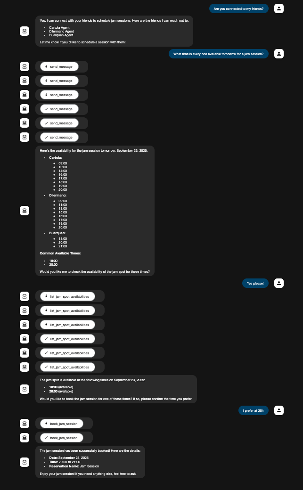

# Jam Session A2A Scheduler

A multi-agent playground that coordinates jam-session bookings over the [A2A](https://a2a-protocol.org/latest/) protocol. Four independent agents, each built with a different agent framework – collaborate to collect availability, reconcile calendars, and reserve a jam spot for the band.

## Agent Fleet and Frameworks
- **Host Agent (`host_agent_adk`) – Google Agent Development Kit (ADK).** Acts as the conductor. It uses Google ADK's `Runner` to orchestrate conversations, fan out scheduling requests to the friends, call booking tools, and stream updates back through the A2A server.
- **Buarque Agent (`buarque_agent_langgraph`) – LangGraph + LangChain.** Wraps a LangGraph ReAct graph with shared memory to answer availability questions by calling the `get_availability` tool over a randomized calendar.
- **Dilermano Agent (`dilermano_agent_crewai`) – CrewAI.** Spins up a single-agent crew that relies on CrewAI's task/agent abstractions. The assistant invokes a custom `AvailabilityTool` backed by a synthetic calendar and answers in natural language.
- **Cartola Agent (`cartola_agent_adk`) – Google Agent Development Kit (ADK).** Builds a lightweight ADK `LlmAgent` that delegates availability lookups to a tool implemented in Python. The agent streams partial responses through the ADK runner for richer progress updates.

Each agent exposes an A2A-compatible HTTP server via `uvicorn`, so the Host can reach them with the A2A messaging tools.

## Architecture at a Glance
1. A user talks to the Host Agent (running with ADK Web). The host gathers intent, pings the friend agents for openings, cross-references jam spot availability, and books the session.
2. Friend agents (Buarque, Dilermano, Cartola) expose a single scheduling skill and respond with their free time using their respective frameworks.
3. The Host reconciles the responses, confirms a viable slot with the user, and calls the booking tool to finalize the jam.

The `conversation_example.png` file shows a sample exchange across the fleet.



## Prerequisites
- Python 3.10–3.12.
- [uv](https://docs.astral.sh/uv/getting-started/installation/) for environment and dependency management.
- An `OPENAI_API_KEY` with access to `gpt-4o-mini` (used by all agents via LangChain, CrewAI, or ADK LiteLLM integrations).

## Environment Configuration
Create a `.env` file inside each agent directory (samples are already provided) and define at minimum:

```bash
OPENAI_API_KEY="sk-..."
```

## Run the Agents
You will need to run each agent in a separate terminal window. The first time you run these commands, `uv` will create a virtual environment and install all necessary dependencies before starting the agent.

### Terminal 1: Run Buarque Agent
```bash
cd buarque_agent_langgraph
uv venv
source .venv/bin/activate
uv run --active app/__main__.py
```

### Terminal 2: Run Dilermano Agent
```bash
cd dilermano_agent_crewai
uv venv
source .venv/bin/activate
uv run --active .
```

### Terminal 3: Run Cartola Agent
```bash
cd cartola_agent_adk
uv venv
source .venv/bin/activate
uv run --active .
```

### Terminal 4: Run Host Agent
```bash
cd host_agent_adk
uv venv
source .venv/bin/activate
uv run --active adk web
```

Once all four terminals report that their servers are listening, open the [ADK Web UI](http://localhost:8000/dev-ui/?app=host) served by the Host Agent to start a scheduling conversation. The host will automatically reach out to the friend agents and stream back progress updates and booking confirmations.

Happy jamming!
